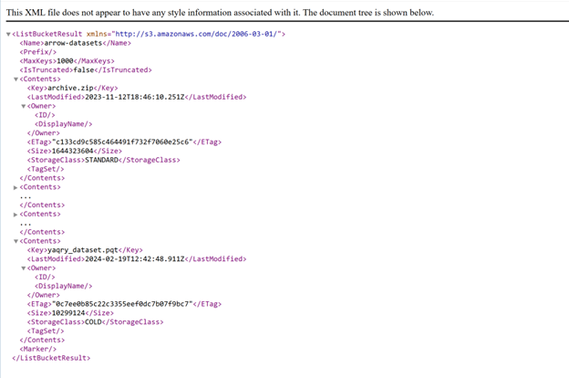
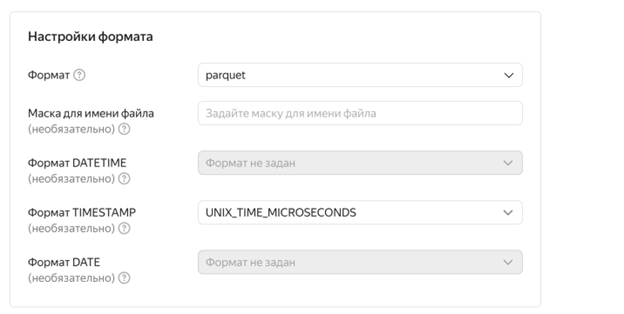
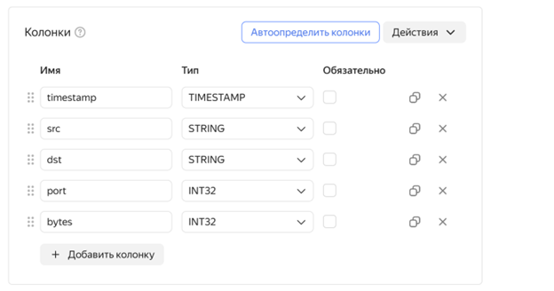
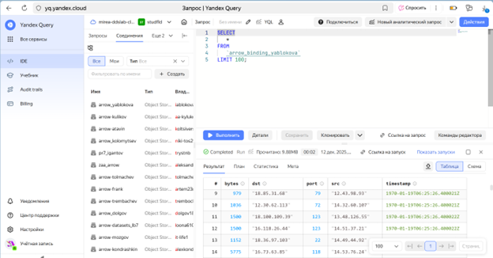
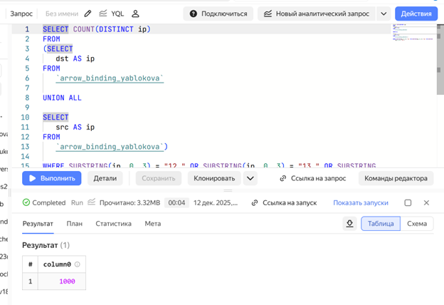
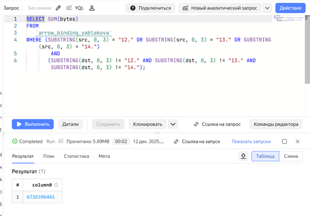
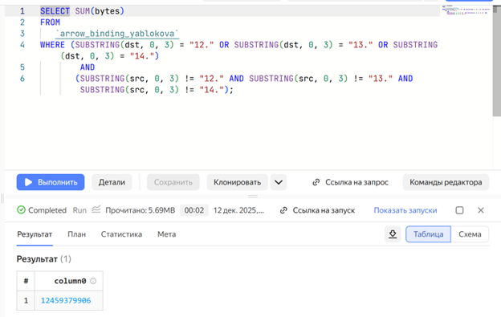

# Использование технологии Yandex Query для анализа данных сетевой
активности
iablokovasofia@yandex.ru

## Цель работы:

1.  Изучить возможности технологии Yandex Query для анализа
    структурированных наборов данных
2.  Получить навыки построения аналитического пайплайна для анализа
    данных с помощью сервисов Yandex Cloud
3.  Закрепить практические навыки использования SQL для анализа данных
    сетевой активности в сегментированной корпоративной сети

## Исходные данные

1.  Программное обеспечение Windows 10
2.  Rstudio Desktop
3.  Наше рабочее окружение

``` r
sessionInfo()
```

    R version 4.5.1 (2025-06-13 ucrt)
    Platform: x86_64-w64-mingw32/x64
    Running under: Windows 10 x64 (build 19045)

    Matrix products: default
      LAPACK version 3.12.1

    locale:
    [1] LC_COLLATE=Russian_Russia.utf8  LC_CTYPE=Russian_Russia.utf8   
    [3] LC_MONETARY=Russian_Russia.utf8 LC_NUMERIC=C                   
    [5] LC_TIME=Russian_Russia.utf8    

    time zone: Europe/Moscow
    tzcode source: internal

    attached base packages:
    [1] stats     graphics  grDevices utils     datasets  methods   base     

    loaded via a namespace (and not attached):
     [1] compiler_4.5.1    fastmap_1.2.0     cli_3.6.5         tools_4.5.1      
     [5] htmltools_0.5.8.1 rstudioapi_0.17.1 yaml_2.3.10       rmarkdown_2.30   
     [9] knitr_1.50        jsonlite_2.0.0    xfun_0.53         digest_0.6.37    
    [13] rlang_1.1.6       evaluate_1.0.5   

## План

Проверить доступность данных в Яндекс.Облачном хранилище 1.1. Проверить
доступность данных (файл yaqry_dataset.pqt) в корзине arrow-datasets S3
хранилища Яндекс.Облачное хранилище.

Подключить бакет в качестве источника данных для Yandex Query 2.1.
Создать соединение для бакета в хранилище S3 (заполнить поля с учетом
допустимых символов, выбрать тип аутентификации — публичный. Ввести имя
бакета в соответствующее поле и сохранить ) 2.2. Создать и настроить
привязку (указать, какой объект использовать в качестве источника
данных).

Анализ 3.1. Известно, что IP-адреса внутренней сети начинаются с
октетов, принадлежащих интервалу 12–14. Определить количество хостов
внутренней сети, представленных в наборе данных. 3.2. Определить общий
объем исходящего трафика. 3.3. Определить общий объем входящего трафика.

## Шаги:

Шаг 1

Проверим доступность данных Перейдём по ссылке и проверим доступность
данных



Шаг 2 Создадим соединение для бакета в S3 хранилище


Создадим и настроим привязку данных


Опишем данные в колонках





Успешное подключение



Шаг 3 Определим количество хостов внутренней сети, представленных в
датасете. Составим следующий запрос:


    SELECT COUNT(DISTINCT ip)
    FROM 
    (SELECT
       dst AS ip
    FROM
       `arrow_binding_yablokova`

    UNION ALL

    SELECT
       src AS ip
    FROM
       `arrow_binding_yablokova`)

    WHERE SUBSTRING(ip, 0, 3) = "12." OR SUBSTRING(ip, 0, 3) = "13." OR SUBSTRING(ip, 0, 3) = "14.";



1000 хостов во внутренней сети

Определить суммарный объем исходящего трафика.

Составим следующий запрос:

    SELECT SUM(bytes)
    FROM 
       `arrow_binding_yablokova`
    WHERE (SUBSTRING(src, 0, 3) = "12." OR SUBSTRING(src, 0, 3) = "13." OR SUBSTRING(src, 0, 3) = "14.")
            AND
           (SUBSTRING(dst, 0, 3) != "12." AND SUBSTRING(dst, 0, 3) != "13." AND SUBSTRING(dst, 0, 3) != "14.");



Определить суммарный объем входящего трафика.

Составим следующий запрос:

SELECT SUM(bytes) FROM `arrow_binding_yablokova` WHERE (SUBSTRING(dst,
0, 3) = “12.” OR SUBSTRING(dst, 0, 3) = “13.” OR SUBSTRING(dst, 0, 3) =
“14.”) AND (SUBSTRING(src, 0, 3) != “12.” AND SUBSTRING(src, 0, 3) !=
“13.” AND SUBSTRING(src, 0, 3) != “14.”);



## Оценка результата

В результате лабораторной работы мы изучили возможности технологии
Yandex Query для анализа структурированных наборов данных

## Вывод

Таким образом, мы изучили возможности технологии Yandex Query для
анализа структурированных наборов данных
