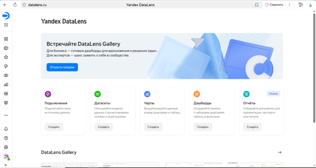
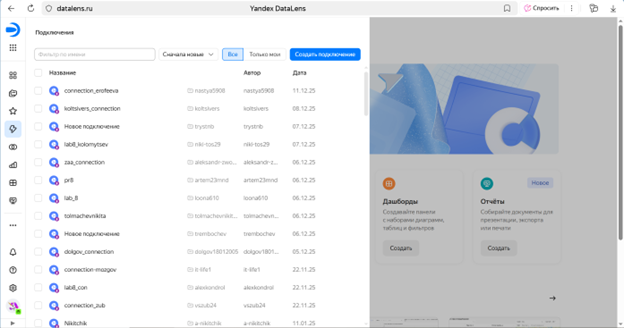
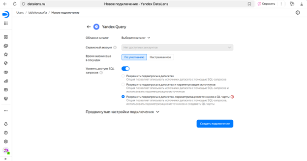
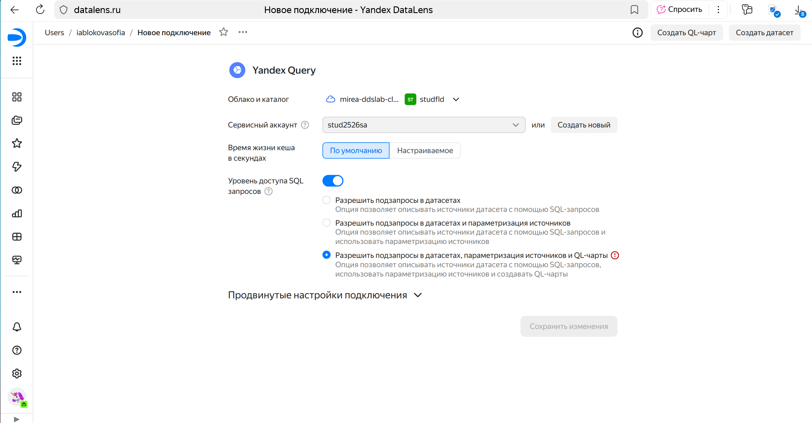
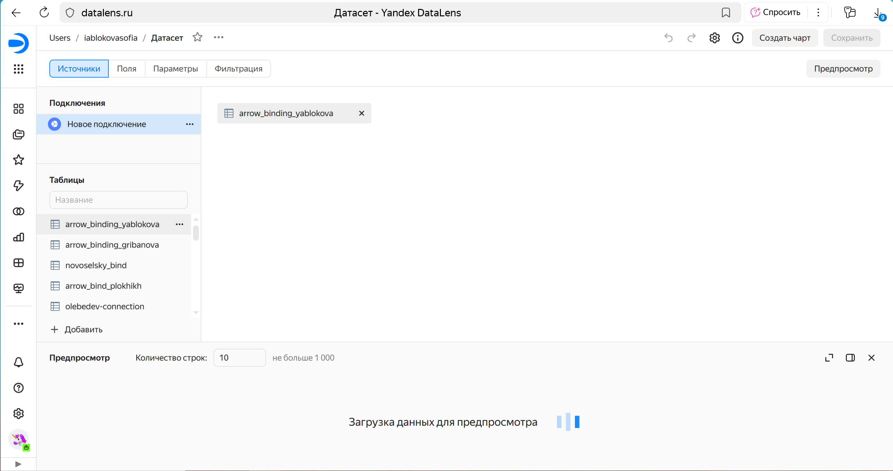
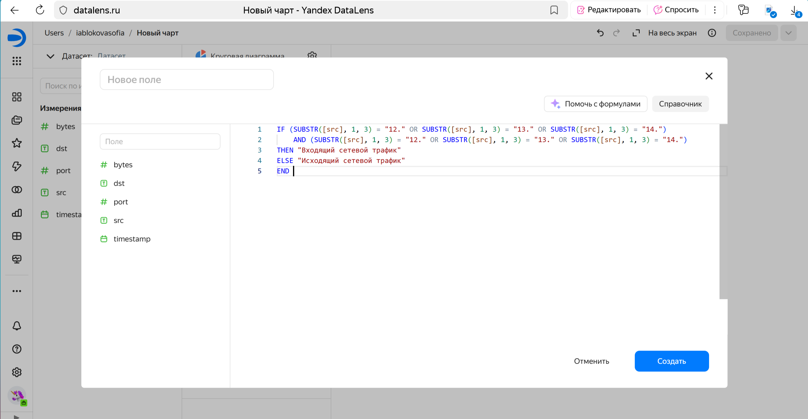
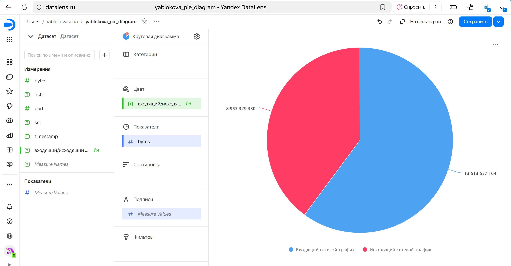
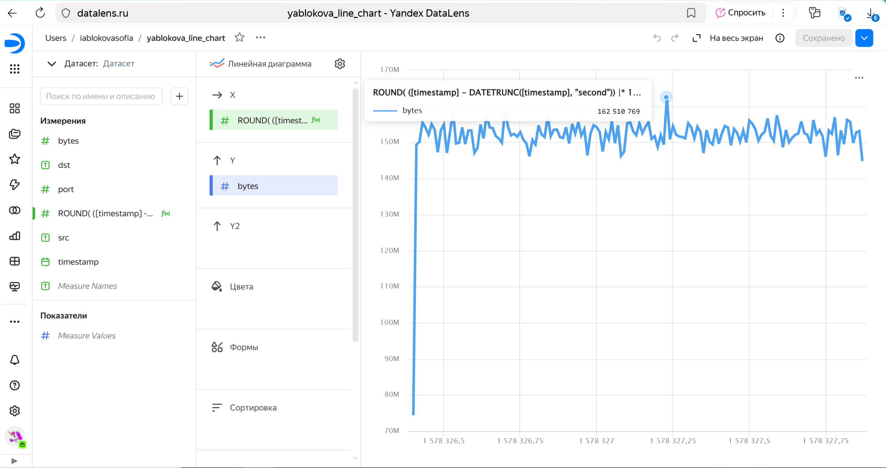
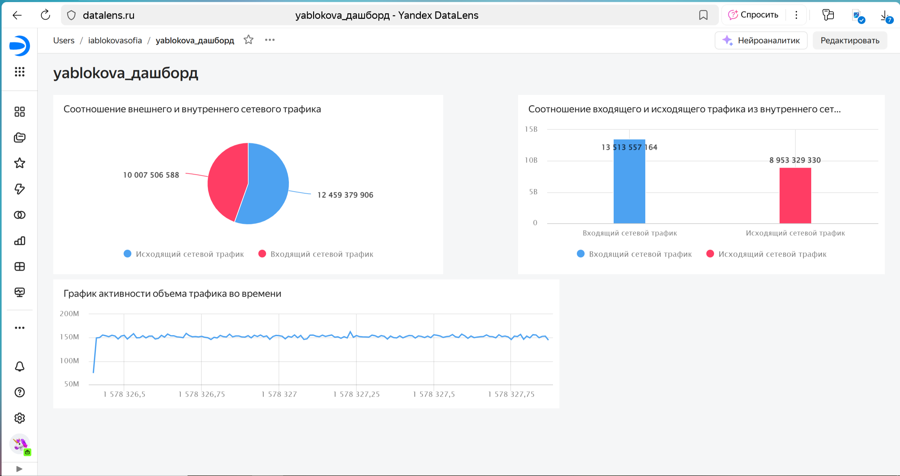

# Использование технологии Yandex DataLens для анализа данных сетевой
активности
iablokovasofia@yandex.ru

## Цель работы:

1.  Изучить возможности технологии Yandex DataLens для визуального
    анализа структурированных наборов данных
2.  Получить навыки визуализации данных для последующего анализа с
    помощью сервисов Yandex Cloud
3.  Получить навыки создания решений мониторинга/SIEM на базе облачных
    продуктов и открытых программных решений
4.  Закрепить практические навыки использования SQL для анализа данных
    сетевой активности в сегментированной корпоративной сети

## Исходные данные

1.  Программное обеспечение Windows 10
2.  Rstudio Desktop
3.  Наше рабочее окружение

``` r
sessionInfo()
```

    R version 4.5.1 (2025-06-13 ucrt)
    Platform: x86_64-w64-mingw32/x64
    Running under: Windows 10 x64 (build 19045)

    Matrix products: default
      LAPACK version 3.12.1

    locale:
    [1] LC_COLLATE=Russian_Russia.utf8  LC_CTYPE=Russian_Russia.utf8   
    [3] LC_MONETARY=Russian_Russia.utf8 LC_NUMERIC=C                   
    [5] LC_TIME=Russian_Russia.utf8    

    time zone: Europe/Moscow
    tzcode source: internal

    attached base packages:
    [1] stats     graphics  grDevices utils     datasets  methods   base     

    loaded via a namespace (and not attached):
     [1] compiler_4.5.1    fastmap_1.2.0     cli_3.6.5         tools_4.5.1      
     [5] htmltools_0.5.8.1 rstudioapi_0.17.1 yaml_2.3.10       rmarkdown_2.30   
     [9] knitr_1.50        jsonlite_2.0.0    xfun_0.53         digest_0.6.37    
    [13] rlang_1.1.6       evaluate_1.0.5   

## План

Настройка подключения к Яндекс.Кью из DataLens 1.1. Перейдите в
соответствующий сервис — https://datalens.yandex.ru 1.2. Выберите
«Подключения» — «Создать новое подключение». 1.3. В разделе «Файлы и
сервисы» выберите «Яндекс.Запрос». 1.4. Настройте и проверьте
подключение

Создать набор данных DataLens на основе запроса YandexQuery

Построить нужные графики и диаграммы 3.1. Представить в виде круговой
диаграммы соотношение внешнего и внутреннего сетевого трафика. 3.2.
Представить в виде столбчатой диаграммы соотношение входящего и
исходящего трафика из внутреннего сетевого сегмента 3.3. Построить
график активности (линейную диаграмму) объема трафика во времени.

Составить дашборд

## Шаги:

Шаг 1

Перейдём на сайт DataLens



Выберем создать новое подключение



В разделе «Файлы и сервисы» выберем «Яндекс.Запрос»



Настроим и проверим подключение Настройка:



Шаг 2 Перенесём ранее созданную таблицу



Шаг 3 Создадим круговую диаграмму соотношения внешнего и внутреннего
сетевого трафика Выберем поле «Диаграмма» и нажмем «Создать чарт»


Для начала создадим дополнительное поле для классификации нашего трафика



Добавим название диаграммы и укажем параметры цвета, показателя и
подписи.

Итоговая диаграмма:



Создадим столбчатую диаграмму соотношения входящего и исходящего трафика
из внутреннего сетевого сегмента Создадим дополнительное поле для
указания входящего или исходящего трафика


Итоговая диаграмма:


Построим график зависимости объёма трафика от времени.

 Итоговая диаграмма:



Шаг 4 Составим дашборд из ранее составленных диаграмм



[Ссылка на итоговый дашборд](https://datalens.yandex/j34qsc12ndre3)

## Оценка результата

В результате лабораторной работы мы изучили возможности технологии
Yandex Query для анализа структурированных наборов данных

## Вывод

Таким образом, мы изучили возможности технологии Yandex Query для
анализа структурированных наборов данных
